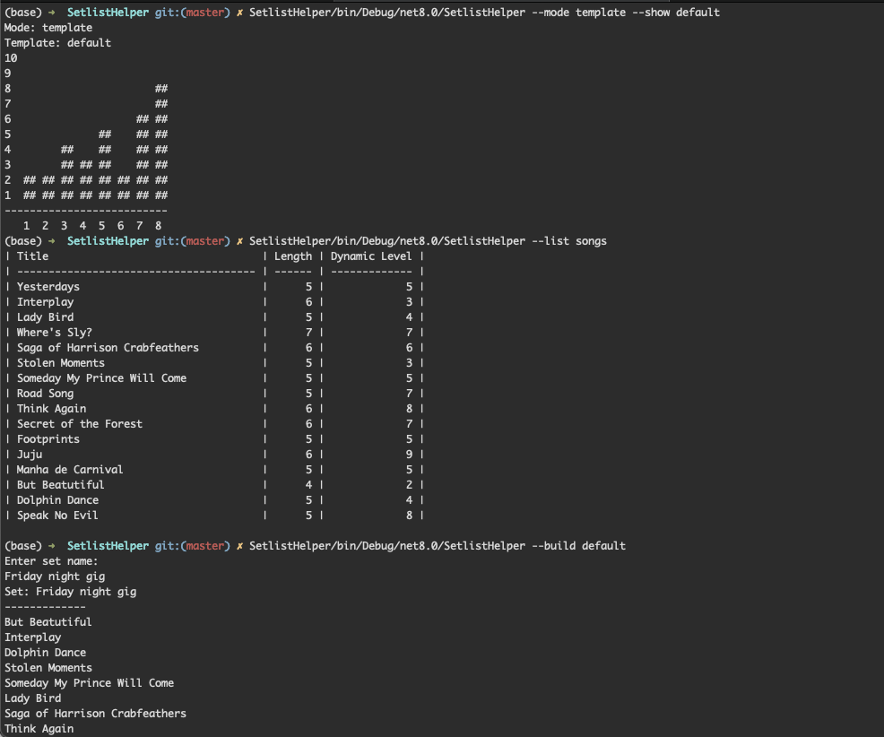

# SetlistHelper

SetlistHelper stores a collection of songs in a musicians repetoire and outputs ideas for a set list for a gig. It constructs the set list from various parameters and properties of the stored songs to artistically craft a set list that is appropriate to the gig.

You can use SetlistHelper to create a set list that maps to a dynamic plot for the set such as starting mellow and crescendoing in intesity towards the end of the set. Make the dynamic plot as simple or as complex as you like.



## Usage
```
SetlistHelper
    Build a set list for the gig based on a dynamic map.

Usage:
    setlist-helper [options] []

Options:
    --help -h                  Show this message
    --build -b [TEMPLATE_NAME] Build a setlist from the template provided. If a
                                template is not provided available templates will
                                be listed. 
    --mode -m [song|template]  Set the edit mode. This affects whether other actions
                                such as add, list, etc. apply to songs or templates
    --add -a TITLE             Add a new song/template
    --remove -r TITLE          Remove a song/template
    --update -u TITLE          Update a song/template
    --list -l [song|template]  List all songs or templates, default=song
```

## Building
SetlistHelper targets .NET 8 and references the following third party packages:

- [CsvHelper](https://joshclose.github.io/CsvHelper/) - Reading/Writing to CSV files
- [Xunit](https://xunit.net/#documentation) - Unit testing
